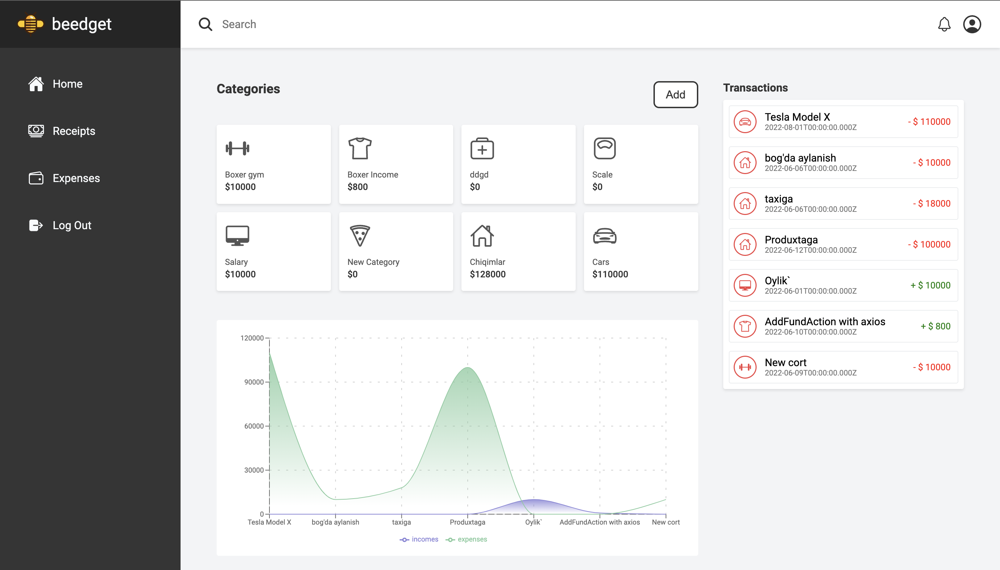

# PERSONAL BUDGET UI

<div id="top"></div>

[![Contributors][contributors-shield]][contributors-url]
[![Forks][forks-shield]][forks-url]
[![Stargazers][stars-shield]][stars-url]
[![Issues][issues-shield]][issues-url]
[![MIT License][license-shield]][license-url]
[![LinkedIn][linkedin-shield]][linkedin-url]


<!-- PROJECT LOGO -->
<br />
<div align="center">
  <a href="https://personal-budget-ui.netlify.app/">
    
  </a>

  <h3 align="center">Personal Bdget UI</h3>

  <p align="center">
    An awesome Personal Budget UI built with React, Redux, and SCSS.
    <br />
    <a href="https://personal-budget-ui.netlify.app/"><strong>Explore the website »</strong></a>
    <br />
    <br />
    <a href="https://personal-budget-ui.netlify.app/">LIVE DEMO</a>
    ·
    <a href="https://github.com/Rustamxon7/personal_budget">Backend Rails API</a>
    ·
    <a href="https://github.com/Rustamxon7/personal_budget_ui/issues">Request Feature</a>
  </p>
</div>


<!-- TABLE OF CONTENTS -->
<details>
  <summary>Table of Contents</summary>
  <ol>
    <li>
      <a href="#about-the-project">About The Project</a>
      <ul>
        <li><a href="#built-with">Built With</a></li>
      </ul>
    </li>
    <li>
      <a href="#getting-started">Getting Started</a>
      <ul>
        <li><a href="#prerequisites">Prerequisites</a></li>
        <li><a href="#installation">Installation</a></li>
      </ul>
    </li>
    <li><a href="#usage">Usage</a></li>
    <li><a href="#roadmap">Roadmap</a></li>
    <li><a href="#contributing">Contributing</a></li>
    <li><a href="#license">License</a></li>
    <li><a href="#contact">Contact</a></li>
    <li><a href="#acknowledgments">Acknowledgments</a></li>
  </ol>
</details>

### Live Demo :    <a href="https://personal-budget-ui.netlify.app/">LIVE DEMO</a>

<!-- LOGIN: 
USER EMAIL test@test.com
USER PASSWORD mmmmmm
 -->

```
LOGIN:

 Email: test@gmail.com
 Password: mmmmmm
```

<!-- ABOUT THE PROJECT -->
## About The Project



The Personal Budget UI is a React, Redux, and SCSS based UI for managing your personal budget.
It is one of my most proud projects. I am proud to say that I have built this project from scratch.

Here's why:
* Front designe is build with HTML and SCSS technologies.
* User friendly
* Available on Desktop only.
* Backend is built with Ruby on Rails API.
* RESTful API with JSON responses.

It looks simple, but it is not.

<p align="right">(<a href="#top">back to top</a>)</p>


### Built With

This section should list any major frameworks/libraries used to bootstrap your project. Leave any add-ons/plugins for the acknowledgements section. Here are a few examples.

* [HTML5 ](https://developer.mozilla.org/en-US/docs/Web/Guide/HTML/HTML5)
* [CSS3 ](https://developer.mozilla.org/en-US/docs/Web/CSS/CSS3)
* [Ruby on Rails ](https://rubyonrails.org/)
* [React ](https://reactjs.org/)
* [Redux ](https://redux.js.org/)
* [SCSS ](https://sass-lang.com/)
* [REST API ](https://restfulapi.net/)

<p align="right">(<a href="#top">back to top</a>)</p>


<!-- GETTING STARTED -->
## Getting Started

### Prerequisites

This is an example of how to list things you need to use the software and how to install them.
* Check your internet connection.
  ```sh
    curl -I https://personal-budget-ui.netlify.app/
  ```

### Installation

1. Get a free API Key at [https://example.com](https://example.com)
2. Clone the repo
   ```sh
   git clone https://github.com/Rustamxon7/personal_budget_ui.git
   ```
3. Run npm install
   ```sh
    npm install
   ```
4. Run npm start
   ```sh
    npm start
   ```
5. Open the browser and go to https://personal-budget-ui.netlify.app/

<p align="right">(<a href="#top">back to top</a>)</p>

<!-- ROADMAP -->
## Roadmap

- [x] Sign up
- [x] Sign in
- [x] Dashboard
- [x] Add a new person
- [x] Add a new budget
- [x] Add a new expense
- [x] Add a new income
- [x] Add a new transfer
- [x] Edit a person
- [x] Edit a budget

See the [open issues](https://github.com/Rustamxon7/personal_budget_ui/issues) for more details.

<p align="right">(<a href="#top">back to top</a>)</p>

<!-- LICENSE -->
## License

Distributed under the [MIT](./MIT). 

<p align="right">(<a href="#top">back to top</a>)</p>


<!-- CONTACT -->
## Contact

Rustamjon Tolipov - [email]() - rustamxontolipov788@gmail.com

Project Link: [https://github.com/Rustamxon7/personal_budget_ui](https://github.com/Rustamxon7/personal_budget_ui)

<p align="right">(<a href="#top">back to top</a>)</p>

<p align="right">(<a href="#top">back to top</a>)</p>


<!-- MARKDOWN LINKS & IMAGES -->
<!-- https://www.markdownguide.org/basic-syntax/#reference-style-links -->
[contributors-shield]: https://img.shields.io/github/contributors/othneildrew/Best-README-Template.svg?style=for-the-badge
[contributors-url]: https://github.com/Rustamxon7/personal_budget_ui/graphs/contributors
[forks-shield]: https://img.shields.io/github/forks/othneildrew/Best-README-Template.svg?style=for-the-badge
[forks-url]: https://github.com/Rustamxon7/personal_budget_ui/network/members
[stars-shield]: https://img.shields.io/github/stars/othneildrew/Best-README-Template.svg?style=for-the-badge
[stars-url]: https://github.com/Rustamxon7/personal_budget_ui/stargazers
[issues-shield]: https://img.shields.io/github/issues/othneildrew/Best-README-Template.svg?style=for-the-badge
[issues-url]: https://github.com/Rustamxon7/personal_budget_ui/issues
[license-shield]: https://img.shields.io/github/license/othneildrew/Best-README-Template.svg?style=for-the-badge
[license-url]: https://github.com/Rustamxon7/personal_budget_ui/blob/master/LICENSE
[linkedin-shield]: https://img.shields.io/badge/-LinkedIn-black.svg?style=for-the-badge&logo=linkedin&colorB=555
[linkedin-url]: https://www.linkedin.com/in/rustamjon-tolipov/
[product-screenshot]: https://www.webmobilefirst.com/en/screencasts/VpImottb_M/
